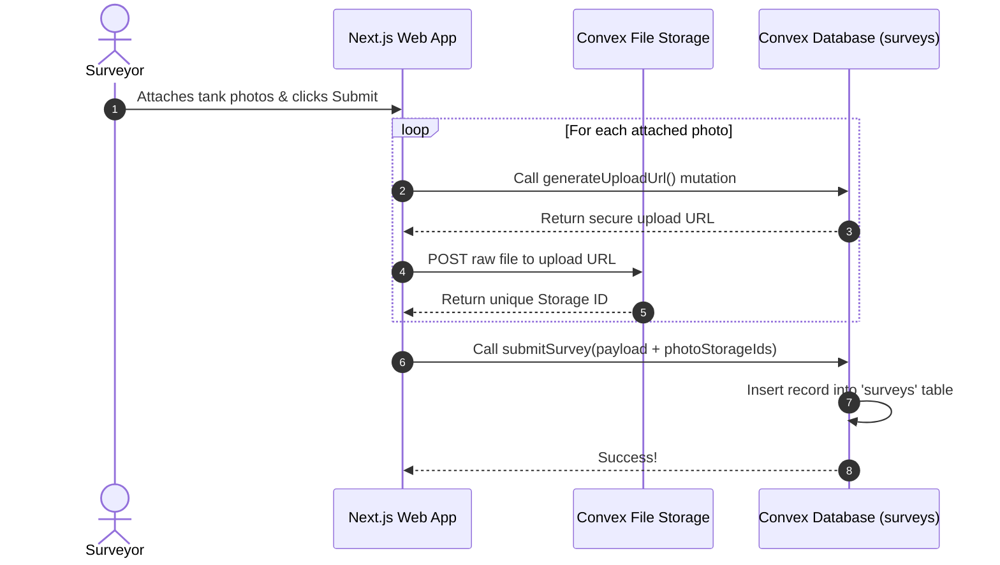

# Convex File Storage & Survey Photo Upload Guide

This document describes how water tank inspection photos are uploaded to Convex File Storage, stored in the database, and rendered in the admin interface.

---

## 1. Overview Flow



---

## 2. Backend Implementation

### Schema Configuration (`convex/schema.ts`)
The `surveys` table includes a list of Convex storage references:
```typescript
surveys: defineTable({
    // ... other survey fields
    numberOfPhotos: v.number(),
    photoStorageIds: v.optional(v.array(v.string())),
    // ...
})
```

### API Mutations (`convex/surveys.ts`)
1. **`generateUploadUrl`**: Generates a secure, short-lived HTTP POST endpoint for file uploads:
   ```typescript
   export const generateUploadUrl = mutation({
     args: {},
     handler: async (ctx) => {
       const identity = await ctx.auth.getUserIdentity();
       if (!identity) throw new ConvexError("UNAUTHENTICATED");
       return await ctx.storage.generateUploadUrl();
     },
   });
   ```
2. **`submitSurvey`**: Stores the uploaded storage IDs in the database:
   ```typescript
   export const submitSurvey = mutation({
     args: {
       // ...
       photoStorageIds: v.optional(v.array(v.string())),
       // ...
     },
     handler: async (ctx, args) => {
       // ...
       const surveyId = await ctx.db.insert("surveys", {
         ...args,
         submittedBy: identity.subject,
         createdAt: Date.now(),
       });
       return surveyId;
     }
   });
   ```

### API Queries (Resolving URLs)
Convex Storage IDs (`tf_...`) are not publicly viewable directly. When querying survey records in `getAll` and `getBySurveyor`, the storage IDs are resolved to secure public URLs:
```typescript
const surveys = await ctx.db.query("surveys").order("desc").collect();
return await Promise.all(
  surveys.map(async (survey) => {
    let photoUrls: string[] = [];
    if (survey.photoStorageIds) {
      photoUrls = await Promise.all(
        survey.photoStorageIds.map((id) => ctx.storage.getUrl(id))
      );
    }
    return {
      ...survey,
      photoUrls: photoUrls.filter(Boolean),
    };
  })
);
```

---

## 3. Frontend Implementation

### Photo Upload Flow (`app/survey/page.tsx`)
Before saving the survey record, the frontend uploads each image file sequentially:
```typescript
// 1. Upload photos to Convex Storage
const photoStorageIds: string[] = [];
const photosToUpload = formData.photoDocumentation.photos;

if (photosToUpload.length > 0) {
  toast.loading("Uploading photos...", { id: "upload-toast" });
  for (const photo of photosToUpload) {
    const uploadUrl = await generateUploadUrl();
    const response = await fetch(uploadUrl, {
      method: "POST",
      headers: { "Content-Type": photo.file.type },
      body: photo.file,
    });
    if (!response.ok) {
      throw new Error(`Failed to upload photo "${photo.file.name}"`);
    }
    const { storageId } = await response.json();
    photoStorageIds.push(storageId);
  }
  toast.dismiss("upload-toast");
}

// 2. Submit survey metadata along with the storage IDs
const payload = buildPayload(photoStorageIds);
await submitSurvey(payload);
```

### Admin Photo Gallery (`app/admin/surveys/page.tsx`)
A lightbox gallery is integrated directly into the submissions table. If a survey contains photos, a badge button is shown:
* Clicking the badge displays a sleek overlay lightbox containing all inspection photos.
* Hovering over the images displays an external link icon, allowing admins to open the high-res file in a new browser tab.
